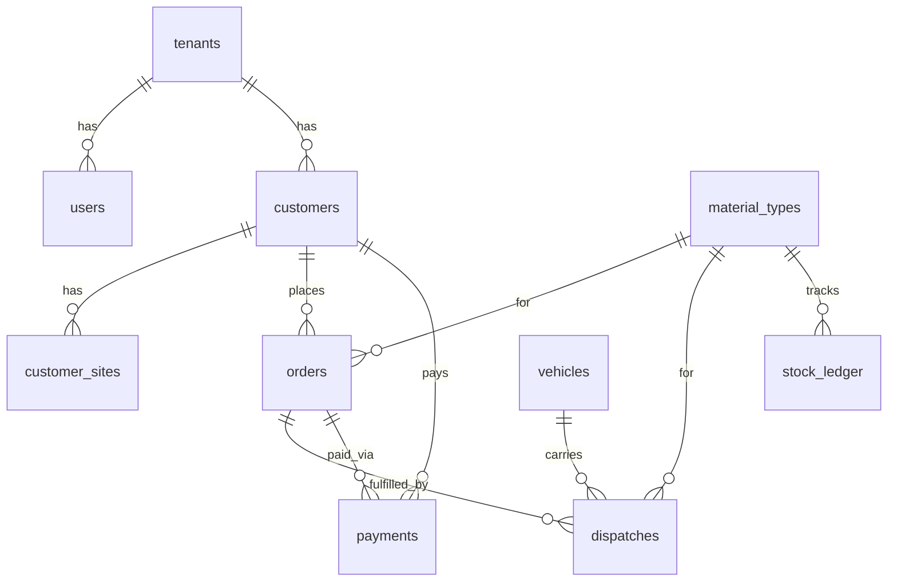

# Tameer360 — Database Schema

PostgreSQL via Supabase. All tables use UUID primary keys unless noted.

## Conventions

- `tenant_id` on every business table
- `created_at`, `updated_at` timestamps (timestamptz)
- Soft delete via `deleted_at` where applicable
- Money stored as `numeric(15,2)` in PKR
- Quantities as `numeric(15,3)`

---

## Phase 1 Tables

### platform.tenants

| Column | Type | Notes |
|--------|------|-------|
| id | uuid PK | |
| slug | varchar(63) UNIQUE | subdomain identifier |
| display_name | varchar(255) | white-label name |
| business_type | enum | brick_kiln, sand, crush, cement, steel, general |
| logo_url | text | nullable |
| primary_color | varchar(7) | hex, default #1e40af |
| accent_color | varchar(7) | hex |
| show_powered_by | boolean | default true |
| is_active | boolean | default true |
| created_at | timestamptz | |
| updated_at | timestamptz | |

### platform.users

| Column | Type | Notes |
|--------|------|-------|
| id | uuid PK | |
| tenant_id | uuid FK | |
| email | varchar(255) | unique per tenant |
| full_name | varchar(255) | |
| role | enum | owner, manager, accountant, viewer |
| is_active | boolean | |
| created_at | timestamptz | |

### customers.customers

| Column | Type | Notes |
|--------|------|-------|
| id | uuid PK | |
| tenant_id | uuid FK | |
| name | varchar(255) | |
| phone | varchar(20) | |
| address | text | |
| type | enum | vendor, contractor, builder, individual |
| credit_limit | numeric(15,2) | nullable |
| notes | text | |
| is_active | boolean | |

### customers.customer_sites

| Column | Type | Notes |
|--------|------|-------|
| id | uuid PK | |
| tenant_id | uuid FK | |
| customer_id | uuid FK | |
| name | varchar(255) | Site A, Site B |
| address | text | |
| is_default | boolean | |

### catalog.material_types

| Column | Type | Notes |
|--------|------|-------|
| id | uuid PK | |
| tenant_id | uuid FK | |
| name | varchar(255) | A Grade Brick |
| code | varchar(50) | A-GRADE |
| unit | enum | piece, ton, cft, bag |
| default_rate | numeric(15,2) | nullable |
| is_active | boolean | |

### inventory.stock_ledger

| Column | Type | Notes |
|--------|------|-------|
| id | uuid PK | |
| tenant_id | uuid FK | |
| material_type_id | uuid FK | |
| transaction_type | enum | opening, production, dispatch, adjustment |
| quantity | numeric(15,3) | signed |
| reference_type | varchar(50) | dispatch, production_batch |
| reference_id | uuid | nullable |
| notes | text | |
| transaction_date | date | |

### sales.orders

| Column | Type | Notes |
|--------|------|-------|
| id | uuid PK | |
| tenant_id | uuid FK | |
| order_number | varchar(50) | auto-generated per tenant |
| customer_id | uuid FK | |
| customer_site_id | uuid FK | nullable |
| material_type_id | uuid FK | |
| ordered_qty | numeric(15,3) | |
| delivered_qty | numeric(15,3) | computed/cached |
| rate | numeric(15,2) | |
| total_amount | numeric(15,2) | ordered_qty × rate |
| received_amount | numeric(15,2) | cached sum of payments |
| expected_delivery_date | date | nullable |
| status | enum | draft, confirmed, partial, fulfilled, cancelled |
| notes | text | |

### dispatch.dispatches

| Column | Type | Notes |
|--------|------|-------|
| id | uuid PK | |
| tenant_id | uuid FK | |
| dispatch_number | varchar(50) | |
| order_id | uuid FK | nullable (walk-in sales) |
| customer_id | uuid FK | |
| customer_site_id | uuid FK | nullable |
| vehicle_id | uuid FK | |
| driver_name | varchar(255) | |
| material_type_id | uuid FK | |
| quantity | numeric(15,3) | |
| rate | numeric(15,2) | |
| amount | numeric(15,2) | quantity × rate |
| delivery_location | text | |
| dispatch_date | date | |
| status | enum | scheduled, loaded, in_transit, delivered, cancelled |
| notes | text | |

### fleet.vehicles

| Column | Type | Notes |
|--------|------|-------|
| id | uuid PK | |
| tenant_id | uuid FK | |
| registration_number | varchar(20) | LEA-1234 |
| type | enum | truck, loader, tractor, dumper |
| owner_type | enum | owned, rented |
| driver_name | varchar(255) | default driver |
| capacity | numeric(15,3) | nullable |
| is_active | boolean | |

### finance.payments

| Column | Type | Notes |
|--------|------|-------|
| id | uuid PK | |
| tenant_id | uuid FK | |
| customer_id | uuid FK | |
| order_id | uuid FK | nullable |
| amount | numeric(15,2) | |
| payment_method | enum | cash, bank, cheque, jazzcash, easypaisa |
| payment_date | date | |
| reference_number | varchar(100) | cheque no, txn id |
| notes | text | |

---

## Computed Views (Phase 1.5)

### customer_ledger_view
- total_purchase (sum order amounts)
- total_received (sum payments)
- remaining_balance
- last_order_date

### order_fulfillment_view
- ordered_qty, delivered_qty, remaining_qty
- fulfillment_percent

### stock_summary_view
- material_type_id, current_stock (sum ledger)

---

## Entity Relationship (MVP)

